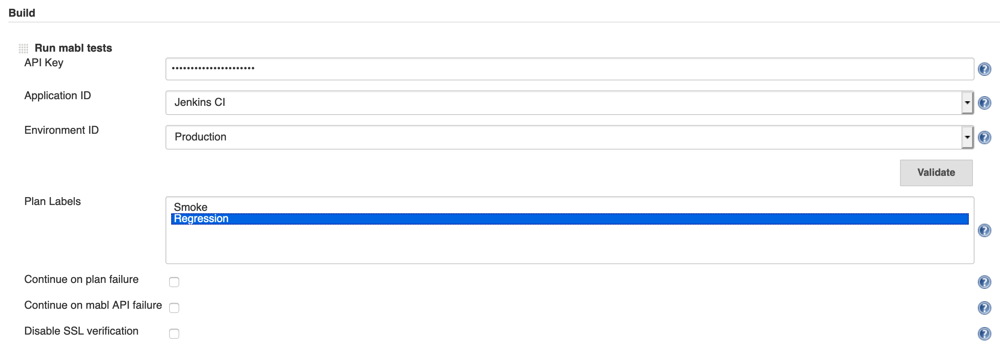

# mabl Jenkins Plugin
[](https://ci.jenkins.io/job/Plugins/job/mabl-integration-plugin/job/master/) [](https://github.com/jenkinsci/mabl-integration-plugin/blob/master/LICENSE) [](https://twitter.com/mablhq)

This plugin allows easy launching of [mabl](https://www.mabl.com) tests as a step in your Jenkins build. Your Jenkins build outcome will be tied to that of your deployment event.

  * [Plugin Installation](#plugin-installation)
  * [Features](#features)
  * [Requirements](#requirements)
  * [Adding a mabl project step](#adding-a-mabl-project-step)
  * [Adding a mabl pipeline step](#adding-a-mabl-pipeline-step)
  * [Environment variable collection](#environment-variable-collection)
  * [Upgrading from previous versions](#upgrade)
  * [Change log](#change-log)
  * [Building from source](#building-from-source)
  * [Local development](#local-development)
      * [Jenkins docker](#jenkins-docker)
      * [Local machine](#local-machine)
  * [Deployment](#deployment)

## Plugin Installation
Install the [plugin](https://plugins.jenkins.io/mabl-integration) into your Jenkins `v2.164+` server from the *Available Plugins* tab by searching for "mabl".

### Features

-   Launch mabl tests as a project step
-   Fail your Jenkins build if the mabl tests fail
    -   Optionally continue on failure

### Requirements

-   Minimum Jenkins version: *2.164.3*
-   Minimum Java runtime version: *8*
-   mabl API key
    -   See [integration
        docs](https://help.mabl.com/v1.0/docs/integrating-mabl-with-your-cicd-workflow#section-the-mabl-deployment-events-api)
        for details  

### Create a Jenkins credential for the mabl API key

-   Add a new credential accessible to the Jenkins job using the Secret text
    credential kind. The scope of the credential must be Global. The credential
    may be placed in any of the credential domains.
-   Set the secret to to the mabl API key
-   Set the ID of the credential to a value of your choosing


          

### Adding a mabl Project Step

Add a *Run mabl tests* step to your new or existing project.


*Select the API key from the drop-down list*. Then select environment, and
application from the drop-down. At least one of environment and application
must be supplied.  All matching plans and their tests will be run during this
step. The step will block until the tests are complete/failed, or one
hour has elapsed.


The *Advanced...* button opens up additional options:

-   Filter by plan labels to run only plans tagged with the selected
    labels. (You can select multiple labels using shift/ctrl click.)



-   Continue execution if your plan/tests fail
-   Continue execution if there is an unexpected error in the mabl API
-   Disable SSL verification


### Adding a mabl Pipeline Step

In a pipeline step, select 'Configure'. In the pipeline script, insert a
pipeline step for mabl. This can be written by hand or created via the
'Pipeline Syntax' tool. Here is an example output:

-   mabl: The pipeline function to be called. - Required
-   applicationId: Selects the application to run deployments
    against (one of environmentId or applicationId is required)
-   continueOnMablError: Continue if there is an unexpected error in the
    mabl API
-   continueOnPlanFailure: Continue if your plan/tests fail
-   environmentId: Selects the environment to run deployments against
    (one of environmentId or applicationId is required)
-   restApiKeyId: The id of the API key secret of the desired deployment workspace -
    Required  

*Note* that if you want to select specific plan labels, then use the 
`labels: ['label1','label2',...,'labeln'].toSet()` syntax in your pipeline step. The Generate Pipeline
Script page in Jenkins does not append `toSet()`. If you do not use labels, then set the value to null,
for example: `labels: null`

The following sections shows how to use the integration plugin in either a declarative or in a scripted
pipeline.

#### Declarative Pipeline

``` syntaxhighlighter-pre
mabl applicationId: 'APP-ID-a', continueOnMablError: true, continueOnPlanFailure: true, environmentId: 'ENV-ID-e', restApiKeyId: 'REST-API-KEY-ID', labels: null
```

#### Scripted Pipeline

``` syntaxhighlighter-pre
node {
   stage('mabl') {
       steps {
           step([$class: 'MablStepBuilder', restApiKeyId: 'REST-API-KEY-ID', environmentId: 'ENV-ID-e', applicationId: 'APP-ID-a', labels: null])
       }
   }
}
```

###  Environment Variable Collection

The mabl plugin will optionally collect build and repository information
to send along with mabl deployments. This will give more information and
insights into testing environment state for test runs. We will not
collect sensitive information such as passwords or API keys.

To enable this feature:

-   Go to the 'Manage Jenkins' page from the 'Dashboard'
-   Go to the 'Configure System' page
-   Find the 'mabl' section and check the 'Send build environment
    variables to mabl' checkbox


Now you will see the environment and build information collected in the
output log of future runs that use a mabl plugin step.

**Example Variable Collections**

``` syntaxhighlighter-pre
Send build environment variables is set. Collecting the following information:
  'GIT_BRANCH' => 'origin/master'
  'GIT_COMMIT' => 'a246e0c756791965bdb6fc9caa1a36775422fcec'
  'GIT_URL' => 'git@github.com:example/my_repository.git'
  'GIT_PREVIOUS_COMMIT' => 'a246e0c73a691935bdb6fc9caa1a36775422fce5'
  'JOB_NAME' => 'mabl integration'
  'BUILD_NUMBER' => '47'
  'RUN_DISPLAY_URL' => 'http://127.0.0.1:9090/job/mabl%20integration/47/display/redirect'
```

### Upgrading from previous versions

#### Upgrading from pre-0.0.20 versions

Note that
* Jenkins versions 1.x are no longer supported
* Minimum required Java version is Java 8
* Jobs with mabl steps will have to be _manually_ updated
  1. Create a Secret text kind credential to store the mabl API key. The scope of the credential must be set to Global.
     The credential may be placed in any of the credential domains.
  1. Make sure that you set the ID of the credentials
  1. Update the mabl step in each affected job 

### Change Log

#### v0.0.28 (29 June 2020)
-   Any plan with the retry option enabled used to fail the build when the first attempt failed even when the
    retry succeeded
-   Fixed an issue when a stopped plan run caused a null pointer exception
-   Updated the test output to include a link to the deployment event in the mabl app

#### v0.0.26 (18 June 2020)
-   Updated Jackson dependencies to 2.11.0

#### v0.0.25 (15 June 2020)
-   Adjusted labels in configuration
-   Set compatibility version
-   0.0.24 was never released

#### v0.0.23 (4 June 2020)
-   Adjusted minimum version to 2.164.3

#### v0.0.22 (4 June 2020)
-   Fix for a benign exception visible in the Jenkins logs

#### v0.0.21 (2 June 2020)
-   Raised minimum version to 2.121.3
-   Switched to use Secret text credential kind for storing mabl API key

#### v0.0.20 (29 May 2020)
-   Moved API key to credentials plugin. Existing users must update their configuration manually.
-   Minimum Java runtime requirement is now Java 7
-   Minimum supported Jenkins version is 1.625.1
-   Fixed incompatibility with Pipeline jobs
-   Replaced FindBugs plugin with SpotBugs

#### v0.0.19 (3 March 2020)
-   Security fixes for handling API key
-   Fixed POM to use Findbugs version variable
-   Improved the plan label form by displaying the currently configured values

#### v0.0.18 (4 February 2020)
-   Screenshot and documentation updates
-   Updates to dependencies

#### v0.0.17 (29 January 2020)
-   API key is now encrypted in configuration file
-   Updated messages to replace journey with test


#### v0.0.16 (04 October 2019)

-   Fix bug when displaying status for multi-stage plans.

#### v0.0.15 (05 September 2019)

-   The output of failed run with link is now available

#### v0.0.13 (30 July 2019)

-   Support for plan label filtering in the mabl build step

#### v0.0.10 (08 June 2018)

-   The mabl plugin is now available to use a pipeline step
-   Optionally allow mabl to collect environment information to enhance
    deployment journey insights

#### v0.0.9 (08 June 2018)

-   The output of mabl tests are now available as junit XML in the
    workspace directory for reports and download  

#### v0.0.8 (18 May 2018)

-   Environment and Application drop downs automatically populated from
    API key

#### v0.0.7 (17 May 2018)

-   More resilient to failures

#### v0.0.6 (18 April 2018)

-   Advanced form validation support added

#### v0.0.5 (13 April 2018)

-   Support for Windows console output and encodings

#### v0.0.4 (12 April 2018)

-   Initial release

## Building from Source

1. Clone this repo
2. build with `mvn clean package`
3. Copy the plugin in `target/mabl-integration.hpi` to your Jenkins `plugins/` directory
4. Restart Jenkins

You can also install the `.hpi` file from the web UI by visting
**Jenkins > Manage Jenkins > Manager Plugins > Advanced > Upload Plugin**.

## Local Development
### Jenkins Docker
Overview of how to launch a Jenkins Docker instance with Jenkins, then build the plugin and deploy it that instance.

*Note:* Please check [Jenkins Hub](https://hub.docker.com/r/jenkins/jenkins)
for any specific image version before pulling Jenkins image.

```bash
# Launch Jenkins container and automatically pull the image if not present
docker run -d -p 9090:8080 --name=jenkins-master jenkins/jenkins

# Find initialAdminPassword to unlock Jenkins on a browser at localhost:9090
docker exec -it jenkins-master bash -c "cat /var/jenkins_home/secrets/initialAdminPassword"

# Setup your Jenkins instance

# Build and deploy plugin to Jenkins (make sure you're in the mabl-integration-plugin directory)
mvn clean package \
  && docker cp target/mabl-integration.hpi jenkins-master:/var/jenkins_home/plugins/ \
  && docker restart jenkins-master
```

### Local Machine
Overview of how to run/debug plugin with Intellij on local machine.

- Open the project in Intellij
- Look for Edit Configurations under Run
- Add Maven template
- Configure your working directory to point to your project path similarly as
the screenshot below:

- Click OK and then run/debug the plugin
- Wait until you see

        INFO: Jenkins is fully up and running

- Log into this URL on your web browser

        localhost:8090/jenkins
Now you can test your plugin.

## Deployment

Before making a new plugin release, ensure code is in high quality, fully tested state. See [extra checks](https://wiki.jenkins.io/display/JENKINS/Plugin+Release+Tips).

1. Update your `~/.m2/settings.xml` according to the [Jenkins docs](https://wiki.jenkins.io/display/JENKINS/Hosting+Plugins#HostingPlugins-Releasingtojenkins-ci.org).
2. Setup and run a GitHub [ssh agent](https://help.github.com/articles/generating-a-new-ssh-key-and-adding-it-to-the-ssh-agent/#adding-your-ssh-key-to-the-ssh-agent).
3. Run `mvn release:prepare release:perform -B` from the HEAD of master
4. Run `mvn deploy` on success of above step.

Wait ~8 hours for plugin to become GA across all Jenkins instances under the "Available Plugins" listing.
