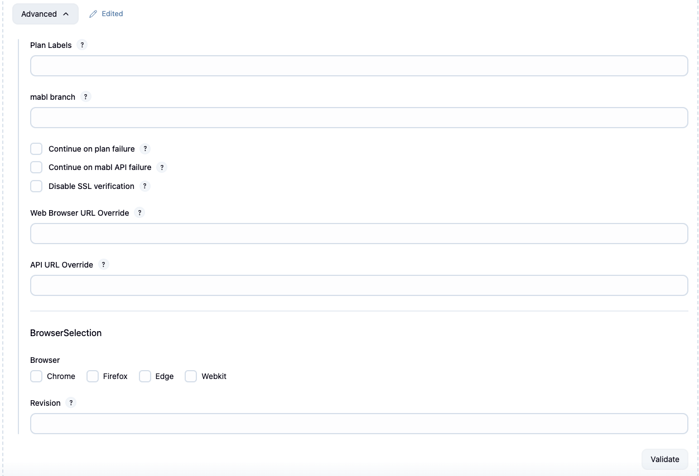
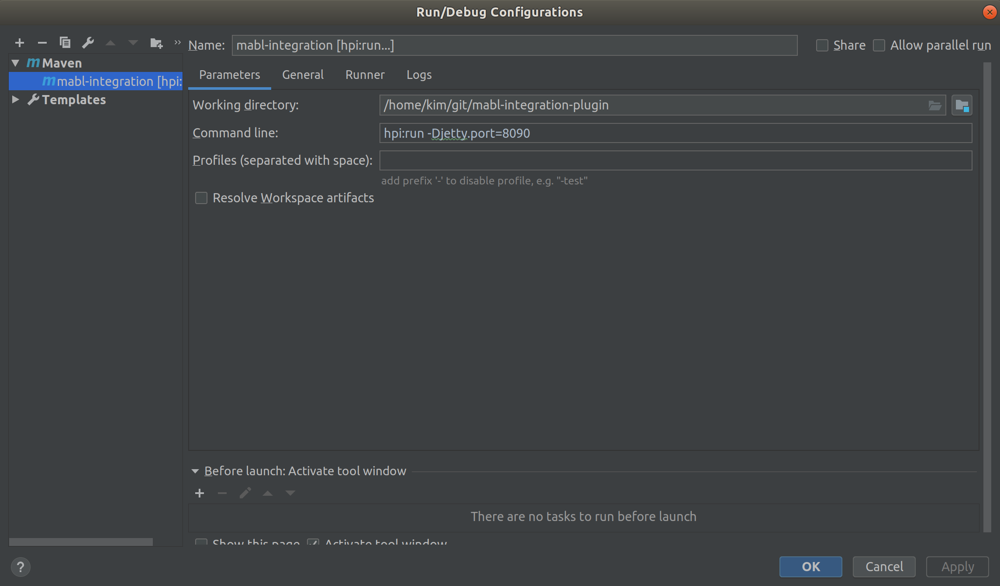

# mabl Jenkins Plugin
[](https://ci.jenkins.io/job/Plugins/job/mabl-integration-plugin/job/main/) [](https://github.com/jenkinsci/mabl-integration-plugin/blob/main/LICENSE) [](https://twitter.com/mablhq)

This plugin allows easy launching of [mabl](https://www.mabl.com) tests as a step in your Jenkins build. Your Jenkins build outcome will be tied to that of your deployment event.

  * [Plugin Installation](#plugin-installation)
  * [Features](#features)
  * [Requirements](#requirements)
  * [Adding a mabl project step](#adding-a-mabl-project-step)
  * [Adding a mabl pipeline step](#adding-a-mabl-pipeline-step)
  * [Environment variable collection](#environment-variable-collection)
  * [Configuring a proxy](#configuring-a-proxy)
  * [Upgrading from previous versions](#upgrading-from-previous-versions)
  * [Change log](#change-log)
  * [Building from source](#building-from-source)
  * [Local development](#local-development)
      * [Jenkins docker](#jenkins-docker)
      * [Local machine](#local-machine)
  * [Deployment](#deployment)

## Plugin Installation
Install the [plugin](https://plugins.jenkins.io/mabl-integration) into your Jenkins `v2.387.3+` server from the *Available Plugins* tab by searching for "mabl".

### Features

-   Launch mabl tests as a project step
-   Fail your Jenkins build if the mabl tests fail
    -   Optionally continue on failure

### Requirements

-   Minimum Jenkins version: *2.387.3*
-   Minimum Java runtime version: *11*
-   mabl API key
    -   See [integration
        docs](https://help.mabl.com/v1.0/docs/integrating-mabl-with-your-cicd-workflow#section-the-mabl-deployment-events-api)
        for details  

### Create a Jenkins credential for the mabl API key

-   Add a new credential accessible to the Jenkins job using the Secret text
    credential kind. The scope of the credential must be Global. The credential
    may be placed in any of the credential domains.
-   Set the secret to to the mabl API key
-   Set the ID of the credential to a value of your choosing


          

### Adding a mabl Project Step

Add a *Run mabl tests* step to your new or existing project.


*Select the API key from the drop-down list*. Then select environment, and
application from the drop-down. At least one of environment and application
must be supplied.  All matching plans and their tests will be run during this
step. The step will block until the tests are complete/failed, or one
hour has elapsed.


The *Advanced...* button opens up additional options:

-   Filter by plan labels to run only plans tagged with the selected
    labels. (You can select multiple labels using shift/ctrl click.)
-   Specify the test branch of your mabl tests
-   Continue execution if your plan/tests fail
-   Continue execution if there is an unexpected error in the mabl API
-   Disable SSL verification



### Adding a mabl Pipeline Step

In a pipeline step, select 'Configure'. In the pipeline script, insert a
pipeline step for mabl. This can be written by hand or created via the
'Pipeline Syntax' tool. The available parameters are:

-   applicationId: Selects the application to run deployments
    against (one of environmentId or applicationId is required)
-   continueOnMablError: Continue if there is an unexpected error in the
    mabl API
-   continueOnPlanFailure: Continue if your plan/tests fail
-   environmentId: Selects the environment to run deployments against
    (one of environmentId or applicationId is required)
-   restApiKeyId: The id of the API key secret of the desired deployment workspace. The id is the value that is assigned in the Jenkins configuration to the corresponding secret. It is not the secret itself.
    Required
-   labels: if specified, only plans with (any of the) labels will be triggered.
    If multiple labels are provided, separate them with commas.
-   mablBranch: if specified, then tests from the specified branch will be executed.
    You may also want to use a Jenkins
    [environment variable](https://www.jenkins.io/doc/pipeline/tour/environment/) to specify the branch.   

Note that if you do not want to specify either the application ID or the environment ID,
then use an *empty* value in the pipeline configuration instead of completely omitting the
corresponding configuration attributes.

The following sections shows how to use the integration plugin in either a declarative or in a scripted
pipeline.

#### Declarative Pipeline

``` syntaxhighlighter-pre
mabl applicationId: 'APP-ID-a', continueOnMablError: true, continueOnPlanFailure: true, environmentId: 'ENV-ID-e', restApiKeyId: 'REST-API-KEY-ID'
```

#### Scripted Pipeline

``` syntaxhighlighter-pre
node {
  stage('mabl') {
    step([$class: 'MablStepBuilder', restApiKeyId: 'REST-API-KEY-ID', environmentId: 'ENV-ID-e', applicationId: 'APP-ID-a'])
  }
}
```

Note that Jenkins pipelines may time out before your tests complete. In this case, adjust
or set the `timeout` option in your pipeline configuration. See the
[Available Options](https://www.jenkins.io/doc/book/pipeline/syntax/#options) section on the
Jenkins documentation site for more information.

###  Environment Variable Collection

The mabl plugin will optionally collect build and repository information
to send along with mabl deployments. This will give more information and
insights into testing environment state for test runs. We will not
collect sensitive information such as passwords or API keys.

To enable this feature:

-   Go to the 'Manage Jenkins' page from the 'Dashboard'
-   Go to the 'Configure System' page
-   Find the 'mabl' section and check the 'Send build environment
    variables to mabl' checkbox


Now you will see the environment and build information collected in the
output log of future runs that use a mabl plugin step.

**Example Variable Collections**

``` syntaxhighlighter-pre
Send build environment variables is set. Collecting the following information:
  'GIT_BRANCH' => 'origin/main'
  'GIT_COMMIT' => 'a246e0c756791965bdb6fc9caa1a36775422fcec'
  'GIT_URL' => 'git@github.com:example/my_repository.git'
  'GIT_PREVIOUS_COMMIT' => 'a246e0c73a691935bdb6fc9caa1a36775422fce5'
  'JOB_NAME' => 'mabl integration'
  'BUILD_NUMBER' => '47'
  'RUN_DISPLAY_URL' => 'http://127.0.0.1:9090/job/mabl%20integration/47/display/redirect'
```

### Configuring a proxy

This plugin requires access to resources hosted on the mabl cloud. If your Jenkins instance cannot directly access
Internet resources, then you have to configure Jenkins to use a proxy.

1. Visit the *Manage Jenkins* and then to the *Manage Plugins* page
2. Click on the *Advanced* tab
3. Fill out the *Server*, *Port*, and - if authentication is needed - the *User name* and/or *Password* fields
   that reflect the proxy configuration in your environment


### Upgrading from previous versions

#### Upgrading from pre-0.0.29 versions

Note that the format of the labels configuration setting has changed. When editing an existing job with labels
configured, make sure that you update the value to be a comma-separated list of values.

#### Upgrading from pre-0.0.20 versions

Note that
* Jenkins versions 1.x are no longer supported
* Minimum required Java version is Java 8
* Jobs with mabl steps will have to be _manually_ updated
  1. Create a Secret text kind credential to store the mabl API key. The scope of the credential must be set to Global.
     The credential may be placed in any of the credential domains.
  1. Make sure that you set the ID of the credentials
  1. Update the mabl step in each affected job 

### Change Log

#### v0.0.49 (08/20/2024)
- Update documentation
- Increased minimum Jenkins version

#### v0.0.48 (03/13/2024)
- Fix broken documentation link
- Fix continueOnPlanFailure

#### v0.0.47 (07/06/2023)
- Patched security vulnerabilities
- Increased minimum Jenkins version

#### v0.0.46 (11/15/2022)
- Replace usages of deprecated imports

#### v0.0.45 (5/18/2022)
- Updated credentials plugin dependency to address security vulnerability
- Update README to clarify set up and validation steps

#### v0.0.44 (12/11/2021)
- Increased timeout to trigger large deployments
- Increased timeout for maximum test run duration
- Updated documentation on increasing default Jenkins pipeline timeout

#### v0.0.43 (11/30/2021)
- Updated documentation to clarify how to omit application ID or environment ID from pipelines
- Updated GSON, SpotBugs and Jenkins Maven HPI plugin dependencies
- Remove dependence on Jenkins Base64 class

#### v0.0.42 (10/07/2021)
- Fixed an issue where the associated test cases IDs were incorrectly recorded in the generated JUnit report
- Updated WireMock, JUnit, GSON, SpotBugs dependencies
- Address warnings on new SpotBugs findings

#### v0.0.40 (07/07/2021)
- Changed minimum Jenkins version to 2.222.4 (pre-requisite for updating credentials plugin dependency)
- Updated credentials plugin dependency to address security vulnerability
- Updated plain-credentials, wiremock dependencies

#### v0.0.39 (05/25/2021)
- Increased request timeout for interacting with mabl API
- Added retry handler for idempotent operations when interacting with mabl API
- Update components: Wiremock, JUnit5, GSON, Spotbugs, JaCoCo

#### v0.0.38 (04/01/2021)
-   Added support for running plugin with Java Runtime Environment 11
-   Added GSON library for deserializing from JSON
-   Replaced Jackson with XStream for XML serialization
-   Updated pipeline sample and clarified how to use REST API keys 

#### v0.0.37 (03/29/2021)
-   Added support for using forward proxies for interacting with mabl
-   Updated JUnit, Mockito, JSON, Jackson, Spotbugs dependencies

#### v0.0.36 (12/23/2020)
-   Updated Apache HTTP client, Mockito, Jackson, Jenkins HPI plugin,
    and Spotbugs dependencies

#### v0.0.35 (10/06/2020)
-   Updated Wiremock, JUnit, Jackson, Spotbugs and JaCoCo dependencies
-   Added validation for branch field
-   Added trimming whitespaces from labels
-   Removed use of deprecated API endpoint

#### v0.0.34 (09/04/2020)
-   Set explicit dependency on credentials and plain credentials
    dependency to address incompatibility issue with Jenkins Enterprise

#### v0.0.32 (08/28/2020)
-   Added JaCoCo test coverage report and checks
-   Updated JUnit, Mockito dependency
-   Added unit test for branching
-   Revised Jenkins BOM dependency for compatibility reasons

#### v0.0.31 (08/12/2020)
-   Fixed a regression related to default endpoints

#### v0.0.30 (08/10/2020)
-   Updated JUnit report to include information about test case IDs in
    both the properties section of the TestSuite tag as well as in the non-standard
    properties section of the TestCase tag following the format used by the
    [XRay application](https://docs.getxray.app/display/XRAYCLOUD/Taking+advantage+of+JUnit+XML+reports)
-   Updated JUnit report to include information about the number of skipped tests. The report
    file now also includes an empty Skipped element inside the corresponding TestCase-s.
-   Fixed code to properly populate the execution time for tests
-   Updated code to use main instead of master
-   Changed plan label configuration to use a single text box to avoid a problem related to inadvertently
    clearing out existing values on save
-   Updated mockito, wiremock, jackson, maven-hpi-plugin and spotbugs dependencies
-   Enabled using alternate mabl endpoints for internal testing purpose
-   Updated test output to indicate when a plan is retried

#### v0.0.29 (7 July 2020)
-   Added a configuration option to execute mabl tests in a branch
-   Updated mockito core dependency and marked it for test scope only

#### v0.0.28 (29 June 2020)
-   Any plan with the retry option enabled used to fail the build when the first attempt failed even when the
    retry succeeded
-   Fixed an issue when a stopped plan run caused a null pointer exception
-   Updated the test output to include a link to the deployment event in the mabl app

#### v0.0.26 (18 June 2020)
-   Updated Jackson dependencies to 2.11.0

#### v0.0.25 (15 June 2020)
-   Adjusted labels in configuration
-   Set compatibility version
-   0.0.24 was never released

#### v0.0.23 (4 June 2020)
-   Adjusted minimum version to 2.164.3

#### v0.0.22 (4 June 2020)
-   Fix for a benign exception visible in the Jenkins logs

#### v0.0.21 (2 June 2020)
-   Raised minimum version to 2.121.3
-   Switched to use Secret text credential kind for storing mabl API key

#### v0.0.20 (29 May 2020)
-   Moved API key to credentials plugin. Existing users must update their configuration manually.
-   Minimum Java runtime requirement is now Java 7
-   Minimum supported Jenkins version is 1.625.1
-   Fixed incompatibility with Pipeline jobs
-   Replaced FindBugs plugin with SpotBugs

#### v0.0.19 (3 March 2020)
-   Security fixes for handling API key
-   Fixed POM to use Findbugs version variable
-   Improved the plan label form by displaying the currently configured values

#### v0.0.18 (4 February 2020)
-   Screenshot and documentation updates
-   Updates to dependencies

#### v0.0.17 (29 January 2020)
-   API key is now encrypted in configuration file
-   Updated messages to replace journey with test


#### v0.0.16 (04 October 2019)

-   Fix bug when displaying status for multi-stage plans.

#### v0.0.15 (05 September 2019)

-   The output of failed run with link is now available

#### v0.0.13 (30 July 2019)

-   Support for plan label filtering in the mabl build step

#### v0.0.10 (08 June 2018)

-   The mabl plugin is now available to use a pipeline step
-   Optionally allow mabl to collect environment information to enhance
    deployment journey insights

#### v0.0.9 (08 June 2018)

-   The output of mabl tests are now available as junit XML in the
    workspace directory for reports and download  

#### v0.0.8 (18 May 2018)

-   Environment and Application drop downs automatically populated from
    API key

#### v0.0.7 (17 May 2018)

-   More resilient to failures

#### v0.0.6 (18 April 2018)

-   Advanced form validation support added

#### v0.0.5 (13 April 2018)

-   Support for Windows console output and encodings

#### v0.0.4 (12 April 2018)

-   Initial release

## Building from Source

1. Clone this repo
2. build with `mvn clean package`
3. Copy the plugin in `target/mabl-integration.hpi` to your Jenkins `plugins/` directory
4. Restart Jenkins

You can also install the `.hpi` file from the web UI by visting
**Jenkins > Manage Jenkins > Manager Plugins > Advanced > Upload Plugin**.

## Local Development
### Jenkins Docker
Overview of how to launch a Jenkins Docker instance with Jenkins, then build the plugin and deploy it that instance.

*Note:* Please check [Jenkins Hub](https://hub.docker.com/r/jenkins/jenkins)
for any specific image version before pulling Jenkins image.

```bash
# Launch Jenkins container and automatically pull the image if not present
docker run -d -p 9090:8080 --name=jenkins jenkins/jenkins

# Find initialAdminPassword to unlock Jenkins on a browser at localhost:9090
docker exec -it jenkins bash -c "cat /var/jenkins_home/secrets/initialAdminPassword"

# Setup your Jenkins instance

# Build and deploy plugin to Jenkins (make sure you're in the mabl-integration-plugin directory)
mvn clean package \
  && docker cp target/mabl-integration.hpi jenkins:/var/jenkins_home/plugins/ \
  && docker restart jenkins
```

### Compatibility with Jenkins Enterprise

To ensure compatibility with Jenkins Enterprise, make sure the credentials
and plain credentials dependencies are compatible in the minimum version
of the enterprise release. Check the plugin list in the
[CloudBees Jenkins Distribution](https://docs.cloudbees.com/docs/release-notes/latest/cloudbees-jenkins-distribution/)
Release Notes.

You can also test with Jenkins Enterprise using the images published
on [Docker Hub](https://hub.docker.com/r/cloudbees/jenkins-enterprise).

```bash
# Launch Jenkins Enterprise container and automatically pull the image if not present
docker run -d -p 9090:8080 --name=jenkins cloudbees/jenkins-enterprise

# Find initialAdminPassword to unlock Jenkins on a browser at localhost:9090
docker exec -it jenkins bash -c "cat /var/jenkins_home/secrets/initialAdminPassword"

# Setup your Jenkins instance

# Build and deploy plugin to Jenkins (make sure you're in the mabl-integration-plugin directory)
mvn clean package \
  && docker cp target/mabl-integration.hpi jenkins:/var/jenkins_home/plugins/ \
  && docker restart jenkins
```

If the plugin is not loaded due to dependency errors, try restarting Jenkins.
```bash
docker restart jenkins
```

### Local Machine
Overview of how to run/debug plugin with Intellij on local machine.

- Open the project in Intellij
- Look for Edit Configurations under Run
- Add Maven template
- Configure your working directory to point to your project path similarly as
the screenshot below:

- Click OK and then run/debug the plugin
- Wait until you see

        INFO: Jenkins is fully up and running

- Log into this URL on your web browser

        localhost:9090/jenkins
Now you can test your plugin.

## Deployment

Before making a new plugin release, ensure code is in high quality, fully tested state. See [extra checks](https://wiki.jenkins.io/display/JENKINS/Plugin+Release+Tips).

1. Update your `~/.m2/settings.xml` according to the [Jenkins docs](https://wiki.jenkins.io/display/JENKINS/Hosting+Plugins#HostingPlugins-Releasingtojenkins-ci.org).
2. Setup and run a GitHub [ssh agent](https://help.github.com/articles/generating-a-new-ssh-key-and-adding-it-to-the-ssh-agent/#adding-your-ssh-key-to-the-ssh-agent).
3. Run `mvn release:prepare release:perform -B` from the HEAD of main
4. Run `mvn deploy` on success of above step.

Wait ~8 hours for plugin to become GA across all Jenkins instances under the "Available Plugins" listing.
